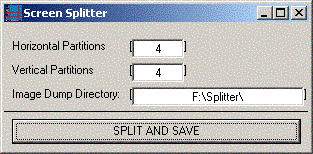



## SplitScreen

### Description

This example Captures the Sreen (Screenshot/Snapshot) and slices it then saves them all (Max. 256 Slices) to a directory. Works without a hitch. Uses BitBlt to capture screen, so it isnt a 'noobish' capture method. The actual capture code is not mine, it is by "SniperElite".
 
### More Info
 
Horizontal Slices

Vertical Slices

Dump Directory

             |
---                |---
**Submitted On**   |2003-02-05 19:14:00
**By**             |[SickAnimations](https://github.com/Planet-Source-Code/PSCIndex/blob/master/ByAuthor/sickanimations.md)
**Level**          |Intermediate
**User Rating**    |4.3 (13 globes from 3 users)
**Compatibility**  |VB 6\.0
**Category**       |[Windows API Call/ Explanation](https://github.com/Planet-Source-Code/PSCIndex/blob/master/ByCategory/windows-api-call-explanation__1-39.md)
**World**          |[Visual Basic](https://github.com/Planet-Source-Code/PSCIndex/blob/master/ByWorld/visual-basic.md)
**Archive File**   |[SplitScree154006262003\.zip](https://github.com/Planet-Source-Code/sickanimations-splitscreen__1-42988/archive/master.zip)

